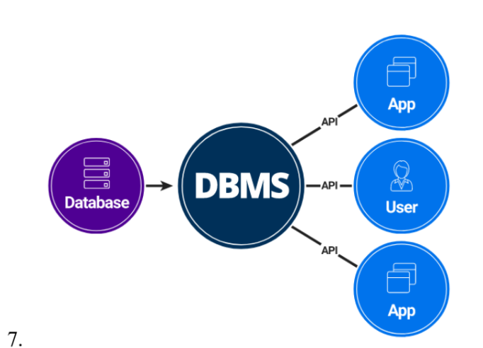

#### notes : https://drive.google.com/file/d/1lNtUlDnDwHwhv8QHFaarsoX4CFK8Ty92/view

### Data
Data is collection of raw bytes, it has no meaning.
Eg: an image is stored as a grid with lots of pixels. Each pixels has a value. 2^8 = 256 values for colors.
We process data to convert them to **information**.

### Database
A location in the computer where the data is stored in bits and bytes for CRUD operation.

### DBMS
Database Management System is a set of programs to help you do CRUD on interrelated data.

---
#### notes : https://drive.google.com/file/d/1bFPIO1ouMXP2A8qFAWr-7XHHALNTXoUv/view

### Abstraction
Hiding unnecessary information from users. 

Let's suppose we have to provide different view to 3 user's. Eg: Amazon has all the information related to a user and his purchases, we need not shre all those details with different departments.

### 3 Schema architecture
Schema is design.

Physical level: Use physical schema to describe physical storage of DB. Eg : Compression, encryption .

Logical level : Conceptual Schema describes what data is stored and their relationship.